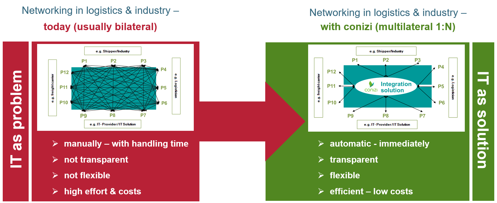

# conizi – one connection to manage your complete supply chain

Conizi is the open data platform for cooperation and transparency within logistics processes. Regardless if you are a Logistics Service Provider (LSP), a shipper or an IT service provider – on this platform you will be able to reach all your partners with one connection – to realize the networks and solutions necessary for your services in logistics.

A smart and process driven data integration service connects the shippers, LSP and IT service providers along the supply chain with one connection. The key to reach this stretch goal is the automation of interfaces between companies and IT solutions. Therefore the platform receives data, converts this data into the conizi format (basis: business objects like consignment) and distributes the converted data based on customer specific business rules. Step by step bilateral interfaces can be eliminated with this smart integration service.

This is the basis to setup and adopt logistic networks for shippers and LSP in an efficient and flexible way. Even adhoc interfaces are possible with this service. You just need to search for the partner or the IT service you require on the platform and start working together – the interface is already there. 

All IT solutions necessary to optimise your supply chain and logistics processes can be found in an open application / module store. You can link different modules together to optimize the processes and cost within your logistic processes. The current focus of the available modules are

1.	The management & optimisation of mobile processes 
2.	The enhancement of your TMS/ERP solutions at the customer interface 
3.	The optimisation of the collaboration between shippers and LSP´s an within these groups

The following single modules are currently available:
+	Habbl: Management of mobile processes
+	Integration module
+	Order Management
+	Track & Trace
+	ToDo Management
+	Archiving
+	DMS (Document Management System)
+	Notification

