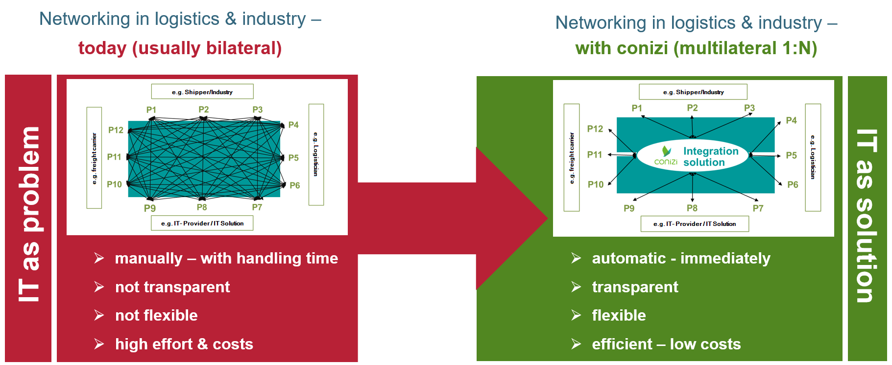

# conizi telematic services 🛰️📍🗺️🚚

---

***Attention, the documentation is still under construction. Please be patient.***

---

The conizi Telematics Services are a collection of services that make it possible to retrieve and process telematics data for various devices that are available on the conizi platform. 

The services have been developed primarily for companies and IT service providers operating in the logistics market. But also new products and business models should be supported.

The following types of data are available:

* GPS Positions
* Vehicle Information
* Driver Information

Also a masterdata service is available to manage a company and their devices.

## How does it work

Lorem ipsum dolor sit amet, consetetur sadipscing elitr, sed diam nonumy eirmod tempor invidunt ut labore et dolore magna aliquyam erat, sed diam voluptua. At vero eos et accusam et justo duo dolores et ea rebum. Stet clita kasd gubergren, no sea takimata sanctus est Lorem ipsum dolor sit amet. Lorem ipsum dolor sit amet, consetetur sadipscing elitr, sed diam nonumy eirmod tempor invidunt ut labore et dolore magna aliquyam erat, sed diam voluptua. At vero eos et accusam et justo duo dolores et ea rebum. Stet clita kasd gubergren, no sea takimata sanctus est Lorem ipsum dolor sit amet. 

 <!--  -->

